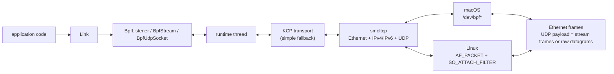

# bpflink

`bpflink` is a Rust crate for building TCP-like async byte streams on top of a
BPF-backed userspace network stack. It owns a real link-layer packet interface,
runs smoltcp for Ethernet/IP/UDP, and carries bpflink stream frames or raw
datagrams inside UDP.

The public API is intentionally small: create one `Link` for an interface, then
create `BpfListener`, `BpfStream`, or `BpfUdpSocket` handles from it.

## Architecture



`Link` is the owner of the packet backend and runtime. Streams, listeners, and
UDP sockets are lightweight async handles; they do not open their own BPF device
or packet socket. This lets multiple handles share one interface binding, one
smoltcp stack, and one transport runtime.

## What It Provides

- TCP-like async API: `Link`, `BpfListener`, and `BpfStream`.
- `tokio::io::AsyncRead` and `AsyncWrite` for stream I/O.
- Raw UDP datagram API: `BpfUdpSocket` and `BpfUdpPacket`.
- Structured runtime configuration through `LinkConfig`, or direct fluent setup
  through `Link::builder()`.
- Explicit lifecycle API: `Link::shutdown`, `Link::close`, and
  `BpfListener::close`.
- Immediate stream abort through `BpfStream::abort()` when graceful
  `AsyncWriteExt::shutdown()` is not desired.
- Timeout helpers for common runtime operations:
  `Link::connect_timeout`, `Link::shutdown_timeout`, and
  `BpfListener::accept_timeout`.
- Runtime stats through `Link::stats` for MTU, payload size, filter status,
  session counts, and packet counters.
- IPv4 and IPv6 local/peer addresses, including scoped link-local input such as
  `fe80::1%en0` at the API/CLI boundary.
- Default KCP transport, with an explicit simple reliable fallback via
  `TransportMode::Simple`.
- Service-port packet filtering for ARP, IPv4 ICMP, IPv6 ICMPv6, and matching
  IPv4/IPv6 UDP traffic.
- Off-link IPv4 and IPv6 peers when the selected interface has a default
  gateway. The runtime reads the gateway and installs it into smoltcp's
  in-process route table; it does not modify host routes.
- A practical diagnostic path for isolating whether macOS on-device network
  enforcement is interfering with a transport experiment.
- Diagnostics helpers and examples for BPF setup, runtime smoke, echo testing,
  nc-like manual transfer, and DNS UDP request/response checks.

## Supported Platforms

`bpflink` currently supports:

- macOS: `/dev/bpf*` packet I/O.
- Linux: `AF_PACKET/SOCK_RAW` packet I/O with classic BPF
  `SO_ATTACH_FILTER`.

Windows is a future support target. Other operating systems are not supported.

Linux support is implemented and validated, but it has Linux-specific operating
requirements: the process needs permission to create raw packet sockets, usually
`CAP_NET_RAW`, and many smoke tests use Docker with `--cap-add NET_RAW` and
`--cap-add NET_ADMIN`.

## Quick Start

Add the crate to your project:

```toml
[dependencies]
bpflink = { git = "https://github.com/Houwenda/bpflink" }
tokio = { version = "1", features = ["io-util", "macros", "rt"] }
```

Create one `Link` per endpoint, declare the service ports it may use, and run
one side as the listener.

Server:

```rust,no_run
use std::net::Ipv4Addr;

use bpflink::{Link, Result};
use tokio::io::{AsyncReadExt, AsyncWriteExt};

#[tokio::main(flavor = "current_thread")]
async fn main() -> Result<()> {
    let link = Link::builder()
        .interface("en0")
        .local_ipv4(Ipv4Addr::new(192, 0, 2, 10))
        .service_ports([40000, 40001])
        .build()
        .await?;

    let listener = link.listen(40000).await?;
    let mut stream = listener.accept().await?;

    let mut buf = vec![0; 1500];
    let n = stream.read(&mut buf).await?;
    println!("received {} bytes", n);
    stream.write_all(&buf[..n]).await?;
    stream.shutdown().await?;

    link.shutdown().await?;
    Ok(())
}
```

Client:

```rust,no_run
use std::net::Ipv4Addr;

use bpflink::{Link, PeerAddr, Result};
use tokio::io::{AsyncReadExt, AsyncWriteExt};

#[tokio::main(flavor = "current_thread")]
async fn main() -> Result<()> {
    let link = Link::builder()
        .interface("en0")
        .local_ipv4(Ipv4Addr::new(192, 0, 2, 11))
        .service_ports([40000, 40001])
        .build()
        .await?;

    let mut stream = link
        .connect(
            PeerAddr {
                ip: Ipv4Addr::new(192, 0, 2, 10).into(),
            },
            40000,
        )
        .await?;
    stream.write_all(b"hello from bpflink").await?;

    let mut buf = vec![0; "hello from bpflink".len()];
    stream.read_exact(&mut buf).await?;
    println!("echo: {}", String::from_utf8_lossy(&buf));

    let stats = link.stats().await?;
    println!("sessions: {}", stats.session_count);

    stream.shutdown().await?;
    link.shutdown().await?;
    Ok(())
}
```

The same setup can be carried as data with `LinkConfig`, which is useful when a
library or application wants to validate configuration before opening the packet
backend:

```rust,no_run
use std::net::{IpAddr, Ipv4Addr};

use bpflink::{LinkConfig, Result, TransportMode};

#[tokio::main(flavor = "current_thread")]
async fn main() -> Result<()> {
    let config = LinkConfig::new(
        "en0",
        IpAddr::V4(Ipv4Addr::new(192, 0, 2, 10)),
        [40000, 40001],
    )
    .transport_mode(TransportMode::Kcp)
    .validate()?;

    let link = config.build().await?;
    link.shutdown().await?;
    Ok(())
}
```

For IPv6, pass `local_ip`, `local_ipv6`, or scoped link-local input:

```rust,no_run
use bpflink::{Link, PeerAddr, Result};

#[tokio::main(flavor = "current_thread")]
async fn main() -> Result<()> {
    let link = Link::builder()
        .interface("bridge100")
        .local_scoped_ip("fe80::1%bridge100")?
        .service_ports([40000])
        .build()
        .await?;

    let stream = link
        .connect(
            PeerAddr::parse_with_interface("fe80::2%bridge100", "bridge100")?,
            40000,
        )
        .await?;

    drop(stream);
    Ok(())
}
```

Use `TransportMode::Simple` only when you explicitly want the fallback engine:

```rust,no_run
use std::net::Ipv4Addr;

use bpflink::{Link, Result, TransportMode};

#[tokio::main(flavor = "current_thread")]
async fn main() -> Result<()> {
    let link = Link::builder()
        .interface("en0")
        .local_ipv4(Ipv4Addr::new(192, 0, 2, 10))
        .service_ports([40000])
        .transport_mode(TransportMode::Simple)
        .build()
        .await?;

    drop(link);
    Ok(())
}
```

`Link` owns one packet backend and one build-time service-port filter. Declare
every port the link may use with `service_ports([...])`; `listen(port)` and
`connect(peer, port)` return `Error::ServicePortNotConfigured` for undeclared
ports. The current classic BPF filter supports up to 16 service ports per
`Link`.

Use `BpfUdpSocket` when you want ordinary UDP request/response traffic over the
same BPF-backed stack instead of a reliable bpflink stream:

```rust,no_run
use std::net::Ipv4Addr;
use std::time::Duration;

use bpflink::{Link, PeerAddr, Result};

#[tokio::main(flavor = "current_thread")]
async fn main() -> Result<()> {
    let link = Link::builder()
        .interface("en0")
        .local_ipv4(Ipv4Addr::new(192, 0, 2, 10))
        .service_ports([53000])
        .build()
        .await?;

    let socket = link.udp_socket(53000).await?;
    socket
        .send_to(
            b"raw udp payload",
            PeerAddr {
                ip: Ipv4Addr::new(192, 0, 2, 53).into(),
            },
            53,
        )
        .await?;

    let packet = socket.recv_from_timeout(Duration::from_secs(3)).await?;
    println!("{} bytes from {}", packet.payload.len(), packet.source);

    link.shutdown().await?;
    Ok(())
}
```

`BpfListener::close()` closes that listener handle and wakes pending
`accept()` calls. It does not close the owning `Link`; a later `listen(port)`
call may listen on the same configured service port again.

Use `AsyncWriteExt::shutdown()` for graceful stream shutdown. Use
`BpfStream::abort()` to send a reset and remove the local session
immediately.

## Runtime Requirements

macOS normally requires root or relaxed permissions for `/dev/bpf*`:

```bash
sudo cargo run --example bpf_smoke -- --interface en0
```

For local development, you can temporarily allow non-root access to BPF devices:

```bash
sudo chgrp admin /dev/bpf*
sudo chmod g+rw /dev/bpf*
```

Linux requires raw packet socket permissions. In Docker, run with packet
capabilities:

```bash
docker run --rm \
  --cap-add NET_RAW --cap-add NET_ADMIN \
  -v "$PWD":/work -w /work \
  rust:1-bookworm \
  cargo run --example bpf_smoke -- --interface eth0
```

## Examples

Build examples:

```bash
cargo build --examples
```

Run a runtime command-loop smoke:

```bash
cargo run --example runtime_smoke -- en0 <local-ip> 40000
cargo run --example runtime_smoke -- en0 <local-ip> 40000 --transport simple
```

Run an echo server and client:

```bash
cargo run --example echo_server -- \
  --interface en0 \
  --local-ip <server-ip> \
  --service-port 40000 \
  --expected-bytes 4096

cargo run --example echo_client -- \
  --interface en0 \
  --local-ip <client-ip> \
  --service-port 40000 \
  --peer-ip <server-ip> \
  --payload-bytes 4096
```

Use `bpfnc` for nc-like interactive checks or file transfer:

```bash
cargo run --example bpfnc -- listen \
  --interface en0 \
  --local-ip <server-ip> \
  --service-port 40000

cargo run --example bpfnc -- connect \
  --interface en0 \
  --local-ip <client-ip> \
  --service-port 40000 \
  --peer-ip <server-ip>
```

One-way file transfer:

```bash
cargo run --example bpfnc -- listen \
  --interface en0 \
  --local-ip <server-ip> \
  --service-port 40000 \
  --recv-only > received.bin

cargo run --example bpfnc -- connect \
  --interface en0 \
  --local-ip <client-ip> \
  --service-port 40000 \
  --peer-ip <server-ip> \
  --send-only < payload.bin
```

`bpfnc` full-duplex mode expects both endpoints to keep stdin open. If one side
is launched from a non-interactive SSH command or with stdin already at EOF, it
will close its stream direction and the peer can see a normal broken-pipe style
close while still typing. Use `--send-only` and `--recv-only` for one-way
transfer.

Resolve A/AAAA records through a selected DNS server over the BPF UDP path:

```bash
cargo run --example dns_resolver -- \
  --interface en0 \
  --local-ip <client-ip> \
  --local-port 53000 \
  --dns-server <dns-server-ip> \
  --name example.com \
  --type both
```

## Verification

Common local checks:

```bash
cargo fmt --check
cargo clippy --all-targets --features test-util -- -D warnings
cargo test --features test-util
cargo check --examples
```

Platform validation flows:

- macOS: see `docs/macos-validation.md`.
- Linux: see `docs/linux-validation.md`.

## Protocol Notes

`bpflink` exposes a TCP-like stream API, but it does not send TCP segments.
Stream data uses bpflink control/data frames inside UDP packets generated by
smoltcp. `BpfUdpSocket` sends and receives caller-provided raw UDP payloads on
configured service ports. KCP is the default reliability engine for streams.

The crate intentionally reuses the host interface IP address. On macOS, the
host stack may also see inbound packets and may emit ICMP Port Unreachable when
there is no matching kernel UDP socket; related ICMP is counted and ignored by
the bpflink runtime.

## Non-goals

- No TCP wire compatibility.
- No encryption or authentication.
- No NAT traversal guarantee.
- No host firewall, PF, nftables, routing rule, or sysctl management.
- No system route mutation; off-link routes are installed only inside smoltcp.
- No automatic interface address discovery or dual-stack peer selection.

See `CHANGELOG.md` for release notes and `RELEASE.md` for the pre-release
checklist.
